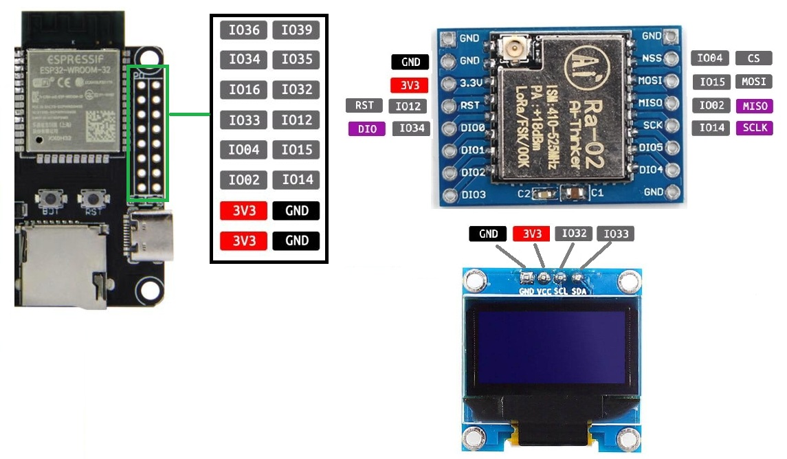

<h1 align = "center">LilyGO T-ETH-POE</h1>

## Automatic installation [firmware](https://f4goh.github.io/LilyGO-T-ETH-POE/index.html) 

## TTGO ETHERNET BOARD


***

## TTGO PINOUT WITH R2 LoRa module 



Serial monitor 115200 Bauds

```console
rst:0x1 (rst:0x1 (POWERON_RESET),boot:0x13 (SPI_FAST_FLASH_BOOT)
configsip: 0, SPIWP:0xee
clk_drv:0x00,q_drv:0x00,d_drv:0x00,cs0_drv:0x00,hd_drv:0x00,wp_drv:0x00
mode:DIO, clock div:2
load:0x3fff0018,len:4
load:0x3fff001c,len:1044
load:0x40078000,len:10124
load:0x40080400,len:5828
entry 0x400806a8
332568
Set SPI pins!
Set LoRa pins!
frequency:
433775000
LoRa init done!
Tache RX en fonctionnement

>Press m key to enter menu
..help command for info

>help
Available commands
Set new callsign                               : call f4goh-6
Set latitude in degrees minutes decimal        : latitude 4753.41N
Set longitude in degrees minutes decimal       : longitude 00016.61E
Set new comment                                : comment hello
Set frequency                                  : freq 433775000
Enable ethernet for igate (aprs.fi)            : internet 1
Disable ethernet connexion for digi only       : internet 0
Set server                                     : server euro.aprs2.net
Set port                                       : port 14580
Set Digipeater enable (0 or 1)                 : digi 1
Show configuration                             : show
Reset default configuration                    : raz
Exit menu                                      : exit
>show
Call is             : f4goh-2
Frequency is        : 433775000
latitude is         : 4753.40N
longitude is        : 00016.60E
Internet is         : Enable
Server is           : euro.aprs2.net
Port is             : 14580
Digipeater is       : Disable
Comment is          : LoRa iGATE : https://github.com/f4goh/lora-aprs-esp32
>exit
>
 Console exit
Wait Ethernet connexion
ETH Started
Wait Ethernet connexion
Wait Ethernet connexion
Wait Ethernet connexion
Wait Ethernet connexion
Wait Ethernet connexion
Wait Ethernet connexion
Wait Ethernet connexion
Wait Ethernet connexion
ETH Connected
ETH MAC: E8:31:CD:CB:6E:67, IPv4: 192.168.1.56, FULL_DUPLEX, 100Mbps
task APRS IS ok
APRS IS Task running  core : 0
Try to connect
tcp APRS Server Connected
Data received with length: 25
# aprsc 2.1.10-gd72a17c
Data received with length: 42
# logresp f4goh-2 verified, server T2FRA
User verified with passcode!
f4goh-2>APLG01:=4753.40NL00016.60E&LoRa iGATE : https://github.com/f4goh/lora-aprs-esp32

Data received with length: 75
# aprsc 2.1.10-gd72a17c 8 Jun 2022 16:16:37 GMT T2FRA 172.26.12.248:14580
```
Now ethernet is disconnected
```
Error: Connection aborted
Disconnect tcp
Try to connect
ETH Disconnected
Try to connect
Try to connect
Try to connect
```
Now ethernet is connected
```
ETH Connected
ETH MAC: E8:31:CD:CB:6E:67, IPv4: 192.168.1.56, FULL_DUPLEX, 100Mbps
Try to connect
tcp APRS Server Connected
Data received with length: 25
# aprsc 2.1.10-gd72a17c
Data received with length: 42
# logresp f4goh-2 verified, server T2FRA
User verified with passcode!
Data received with length: 75
# aprsc 2.1.10-gd72a17c 8 Jun 2022 16:17:13 GMT T2FRA 172.26.12.248:14580
```
Incoming LoRa frame
```
msg queue
f4goh-9>APLT00,WIDE1-1:!4753.41N/00016.61Eb000/000/A=000260Bat:4.06V/-99mA
with RSSI -76
msg aprsis queue
f4goh-9>APLT00,WIDE1-1:!4753.41N/00016.61Eb000/000/A=000260Bat:4.06V/-99mA
Data received with length: 75
# aprsc 2.1.10-gd72a17c 8 Jun 2022 16:17:33 GMT T2FRA 172.26.12.248:14580
```
